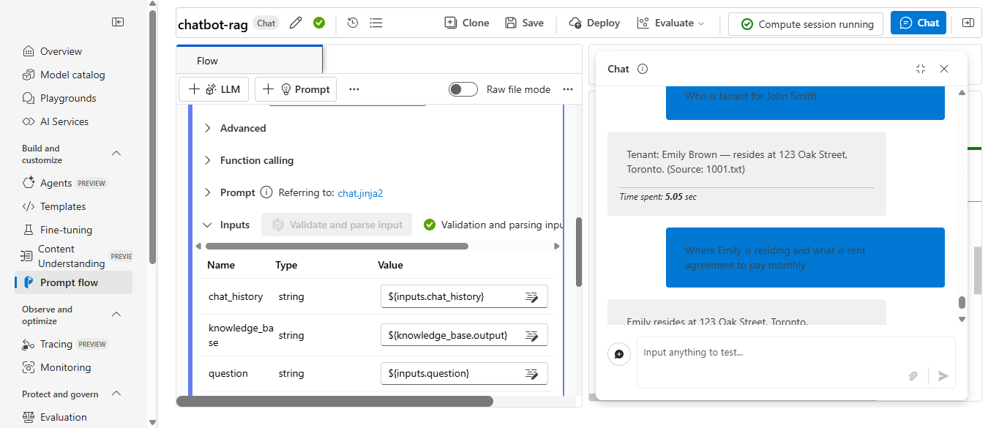
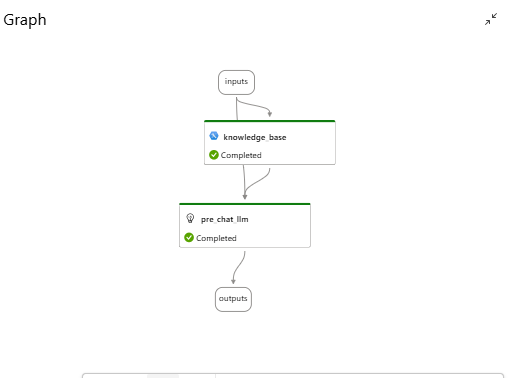

# Chatbot - Chat Flow (Azure AI Foundry) 

This repository contains a **chat-based AI workflow** built using **Azure AI Foundry** with support for **Retrieval-Augmented Generation (RAG)**.  
The flow enables conversational Q&A with a knowledge base, while maintaining chat history for context.

##### Author : SAIDA.D
---

## Overview

- **Flow ID:** `template_chat_flow`  
- **Flow Name:** `Template Chat Flow`  
- **Framework:** Azure AI Foundry (Prompt Flow)  
- **Core Idea:** Build a chatbot that can:
  - Maintain **chat history** for contextual conversations.  
  - Query a **vector database** (Azure Cognitive Search with FAISS/Embeddings).  
  - Use an **LLM (Azure OpenAI GPT-5-mini)** to generate accurate and contextual answers.  

---

## Workflow Design






### **Inputs**
- `chat_history` → Stores conversation context across turns.  
- `question` → User input query.  

### **Outputs**
- `answer` → Final AI-generated answer (chatbot response).  


### Traditional Langchain Chatbot
```python

   from langchain_openai import ChatOpenAI 
   from langchain.prompts import ChatPromptTemplate, MessagesPlaceholder, HumanMessagePromptTemplate
   from langchain.memory import ConversationSummaryMemory,ConversationBufferMemory, FileChatMessageHistory
   from langchain.chains import LLMChain

   api_key="OPENAI_API_KEY"

   # if use completion based models like gpt-3.5-instruct it will prompt error. 
   # gpt-3.5-turbo-0125 models designed for chat purpose only
   llm = ChatOpenAI(model='gpt-3.5-turbo-0125', api_key=api_key, max_completion_tokens=2000)

   chat_history= ConversationBufferMemory(
      chat_memory=FileChatMessageHistory("chat_msgs.json"),
      memory_key='chat_msgs', return_messages=True
   )

   prompt= ChatPromptTemplate(
      # with previous messages
      # chat_msgs this variable must be same as Chat memory Key
      input_variables=['question', 'chat_msgs'],
      messages=[
         # with previous messages
         # chat_msgs this variable must be same as Chat memory Key
         MessagesPlaceholder(variable_name='chat_msgs'),
         
         HumanMessagePromptTemplate.from_template("{question}")
      ]
   )

   chat_chain= LLMChain(prompt=prompt, llm=llm , memory=chat_history)
   while True:
      question=input("You:")
      bot=chat_chain.invoke(input={'question':question})
      print('Bot:',bot['text'])
```
### **Nodes**
1. **knowledge_base (Python tool)**  
   - Performs a vector search over indexed documents.  
   - Uses embeddings (`text-embedding-ada-002`) stored in **Azure Cognitive Search**.  
   - Returns the most relevant top-k results for grounding.  

2. **pre_chat_llm (LLM - Azure OpenAI)**  
   - Model: `gpt-5-mini`  
   - Consumes:
     - `chat_history`
     - `question`
     - `knowledge_base.output` (retrieved documents)  
   - Generates final contextual **answer**.  

---

## Architecture

```
User Question ─┐
               ▼
        [Knowledge Base Lookup] ───► Indexed Docs
               ▼
         [Azure OpenAI LLM]
               ▼
           Final Answer
```

---

## How It Works

1. A user enters a **question**.  
2. The flow retrieves **top-3 relevant documents** from the **vector DB (Azure Cognitive Search)**.  
3. The **LLM (gpt-5-mini)** combines:
   - User’s current question  
   - Chat history  
   - Retrieved knowledge base context  
   - To generate a **relevant, grounded answer**.  
4. Answer is returned to the user and appended to `chat_history`.  

---

## Requirements

Dependencies are listed in `requirements.txt` and installed automatically by Azure AI Foundry.  

Typical libraries:
- `azure-ai-ml`  
- `azure-search-documents`  
- `azure-ai-formrecognizer` (if docs include invoices/structured docs)  
- `promptflow`  

---

## Setup in Azure AI Foundry

1. Create a new **Prompt Flow Project**.  
2. Upload this flow definition (`flow.dag.yaml`).  
3. Configure **connections**:
   - Azure OpenAI connection (`reserch-agent-resource_aoai`)  
   - Azure Cognitive Search connection (`aihubsearchindex`)  
4. Deploy and run the chat flow in **Azure AI Studio Chat Playground**.  

---

## Use Cases

- Customer Support Chatbot  
- Knowledge Retrieval Assistant  
- Document QA Bot (e.g., policies, manuals, FAQs)  
- Enterprise RAG-powered chat systems  

---

## Example Query

**User:**  
> "What is the warranty policy for laptops?"

**System Flow:**  
- Retrieves relevant policy documents from Cognitive Search.  
- Generates an answer grounded in retrieved context.  

**Bot Response:**  
> "Our warranty covers laptops for 2 years, including hardware defects and free repairs at authorized service centers."

---

## Future Enhancements

- Integrate with external APIs for dynamic data (CRM, ERP).  
- Add **multi-turn reasoning tools**.  
- Extend vector DB support beyond Cognitive Search (e.g., FAISS, Pinecone).  
- Logging & analytics for chat interactions.  

---

## License
MIT License – Free to use and modify.
